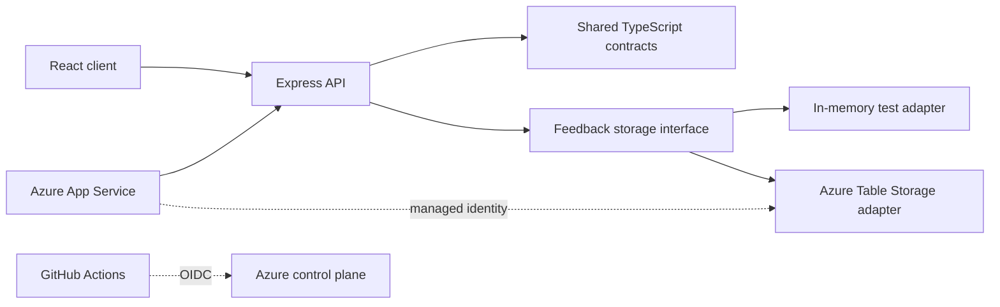

# Repository design

## Purpose

This repository is both a deployable sample application and a teaching harness for an end-to-end Agentic SDLC workshop. It must optimize for participant success within a four-hour session while demonstrating production-oriented engineering controls.

## Design principles

### 1. The repository is the system of record

Architecture, requirements, operational instructions, validation commands, and decision history must be versioned in the repository. Chat history is not an authoritative artifact.

### 2. Context uses progressive disclosure

The root `AGENTS.md` remains a concise map. Detailed knowledge lives near the files it governs:

```text
AGENTS.md                  repository map and universal guardrails
DESIGN.md                  durable system architecture and boundaries
docs/                      explanatory and operational documentation
openspec/                  capability truth and proposed changes
<directory>/AGENTS.md      local rules and validation for that directory
```

Agents should receive the smallest authoritative context that is sufficient for their task.

### 3. Specifications and architecture have different lifetimes

The repository contains two intentionally different design artifacts:

- Root `DESIGN.md` records durable architecture, boundaries, and system-wide decisions.
- `openspec/changes/<change-name>/design.md` records the technical approach and trade-offs for one proposed change.

If a change creates a lasting architectural rule, the implementation task must update root design documentation or add an architectural decision record.

### 4. Constraints should be executable

Important rules should be enforced by tests, linters, workflow permissions, policy, or structural checks. Documentation explains a constraint; automation proves it remains true.

### 5. Agents need closed feedback loops

An agent must be able to discover the applicable requirements, make a bounded change, run relevant validation, and inspect actionable failure output. CI and deployment workflows must expose enough evidence to diagnose failures without hidden instructor knowledge.

### 6. Humans approve intent and risk

Agents may explore, propose, implement, test, and prepare pull requests. Humans approve the specification, architectural trade-offs, security-sensitive changes, and merge/deployment decisions.

## Delivery architecture

Each workshop team receives an isolated repository created from this template.

```mermaid
flowchart LR
    Issue[GitHub issue] --> Change[OpenSpec change]
    Change --> Review[Human spec and design review]
    Review --> Agents[Local and cloud coding agents]
    Agents --> CI[Tests and structural checks]
    CI --> PR[Pull request]
    PR --> Security[Code and dependency scanning]
    Security --> Merge[Human-approved merge]
    Merge --> Deploy[GitHub Actions with Azure OIDC]
    Deploy --> Evidence[Deployment evidence]
    Evidence --> Workflow[GH-AW evidence review]
```



The deployed sample is a TypeScript system with a React browser client and an
Express API. Express serves both the API and the production React bundle from a
single Azure App Service. The API depends on a storage interface: tests use an
in-memory adapter, while the deployed application uses Azure Table Storage
through the App Service system-assigned managed identity.



Dependency direction is inward: UI and transport layers may use shared
contracts, the API may depend on the storage interface, and Azure-specific code
implements that interface. Shared contracts do not depend on React, Express, or
Azure SDK types.

## Repository boundaries

| Area | Responsibility | Local guidance |
|---|---|---|
| `openspec/` | Capability requirements and proposed change artifacts | `openspec/AGENTS.md` |
| `docs/` | Durable explanatory, workshop, and operational knowledge | `docs/AGENTS.md` |
| `infra/` | Azure composition using AVM and environment parameters | `infra/AGENTS.md` |
| `.github/` | CI, deployment, security, Copilot, and GH-AW configuration | `.github/AGENTS.md` |
| `src/` | React UI, Express API, shared contracts, and storage adapters | closest `src/**/AGENTS.md` |
| `tests/` | Unit, API, structural, and focused end-to-end verification | closest `tests/**/AGENTS.md` |

Infrastructure composes pinned Azure Verified Modules (AVM) for supported
resources. Custom Bicep is limited to composition and documented module gaps.
The deployment target is Azure App Service with Azure Table Storage and
monitoring resources in the team's assigned resource group.

## Delivery gates and evidence

Material work uses two review gates:

1. A specification pull request approves the OpenSpec proposal, capability
   scenarios, change design, and bounded tasks.
2. Implementation pull requests demonstrate conformance through independent
   CI, security, infrastructure, and deployment evidence.

The planned workflow contracts are:

| Workflow | Durable responsibility |
|---|---|
| `openspec.yml` | Validate OpenSpec artifacts and repository integrity |
| `ci.yml` | Lint, type-check, test, build, and smoke-test the application |
| `spec-pr-policy.yml` | Require an applicable approved OpenSpec change for governed paths |
| `codeql.yml` | Run CodeQL where repository visibility and licensing permit |
| `dependency-review.yml` | Review dependency changes where the feature is available |
| `infra-validate.yml` | Validate Bicep and produce Azure `what-if` evidence through OIDC |
| `deploy.yml` | Deploy through a protected environment and verify the live application |

These names describe the approved delivery design; documentation must not imply
that a workflow is active until its file and a successful run are present.
Agent reports are not evidence by themselves. Required evidence is produced by
GitHub checks, security features, Azure deployments, protected-environment
approvals, health/readiness probes, and the focused feedback smoke test.

## Security and deployment decisions

- Participant repositories are pre-created from a template rather than forked.
- Every team receives a separately scoped Azure resource group.
- GitHub Actions authenticates to Azure through OIDC.
- Azure federation is constrained to the intended repository and GitHub
  environment; no long-lived Azure client secret is stored.
- App Service uses a system-assigned managed identity with only the required
  Storage Table data-plane role.
- The deployed feedback board allows inbound requests only from explicitly
  configured instructor-approved workshop CIDRs and denies other sources.
  Deployment smoke checks temporarily allow only the current runner's IPv4
  `/32`, then remove and confirm removal before publishing evidence. This
  network boundary is not user authentication.
- Deployment environments may require human approval.
- GitHub workflows default to read-only permissions.
- Agentic workflows use narrow safe outputs and may not self-approve protected changes.
- Security fixes are verified by deterministic scanners and tests, not by agent claims.

## Workshop constraints

- The local environment check must complete before Lab 1.
- Participant labs use the GitHub Copilot App as the primary interface. Chats,
  Plan, Interactive, Fleet, Autopilot, sessions, reviews, checks, and pull
  requests teach the workflow; terminal procedures remain instructor
  operations or agent-executed validation.
- Focused tests should return actionable results within two minutes.
- The standard Azure deployment path should complete within the Lab 3 window.
- Every lab has a happy path, recovery checkpoint, and optional stretch goal.
- Starter tasks are intentionally separable to demonstrate parallel agents without merge contention.
- Fleet is used only after shared dependencies and non-overlapping primary
  ownership are reviewed.

## Workshop operations

The public default branch remains a starter, not an answer key. Operational
state is prepared outside participant time:

- one repository is pre-created from the template for each table of two or
  three participants;
- instructor scripts verify workstation, GitHub, and Azure readiness and seed
  bounded GitHub work;
- the deterministic security exercise exists only on an instructor-created lab
  branch and draft pull request, never as active vulnerable code on the
  template default branch;
- completed checkpoint states remain in a private instructor repository whose
  access excludes participants and are published into a team repository only
  when recovery is needed;
- checkpoint recovery creates a new branch and preserves participant history.

GitHub Actions created with the repository token are not used as the sole
source of seeded pull requests whose creation must trigger other workflows.
Instructor preparation uses authenticated GitHub operations so CodeQL and
other pull-request checks execute normally.

## Final workshop outcome

Each team finishes with a reachable Azure App Service running the React/Express
feedback board, persistent feedback and votes in Azure Table Storage, a merged
implementation pull request linked to its approved OpenSpec change, independent
CI/security/deployment evidence, and a GH-AW evidence review with narrow
authority. A reviewer must be able to reconstruct the issue-to-deployment story
without access to the originating agent conversations.

An optional 90-120 minute capstone extends the workshop without compressing the
four-hour agenda. Teams create a net-new application under
`capstone/<app-name>/` with independent source, tests, CI/CD, AVM/OIDC
deployment, issue-driven defect remediation, GH-AW feedback, and evidence. The
existing feedback application remains unchanged and completed capstone
solutions do not ship on the public template default branch.

Licensing-dependent controls such as CodeQL, dependency review, protected
environments, cloud agents, and GH-AW are confirmed during instructor readiness.
Where a control is unavailable, the workshop records the limitation and uses the
documented fallback without presenting it as equivalent platform enforcement.
